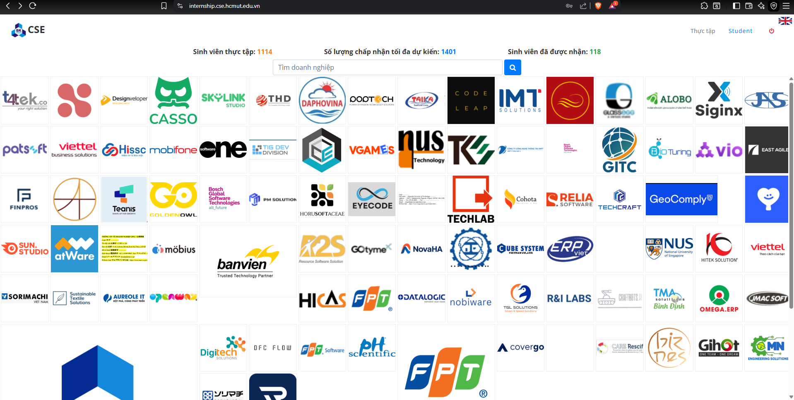
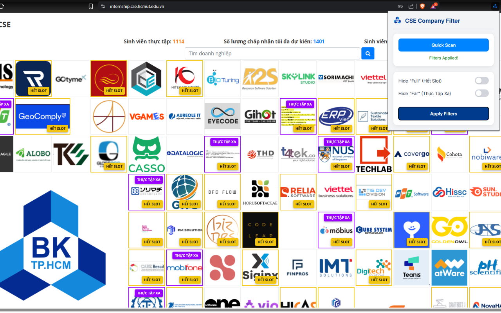
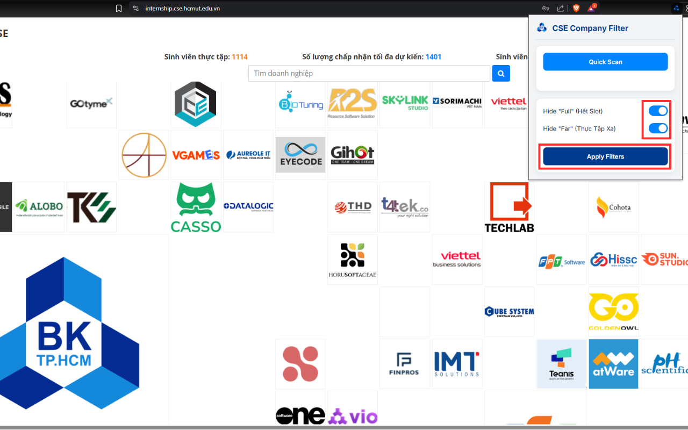

# HCMUT Internship Filter Extension

A Manifest V3 Chrome Extension specifically designed for students of Ho Chi Minh City University of Technology (HCMUT - Bách Khoa). This extension helps filter out companies on the CSE Internship Portal that have already recruited enough students or are located too far from the campus.

## Features

- **Scan Companies:** Quickly scans the list of companies on the internship portal via background API requests.
- **Filter "Hết Slot" (Full):** Identifies companies that have explicitly stated they have enough students (e.g., "Chương trình đã nhận đủ SV").
- **Filter "Thực Tập Xa" (Far):** Identifies companies located far away from the HCMUT campus.
- **Hide Functionality:** Allows you to instantly hide these filtered companies from the grid to declutter your view and focus on available opportunities.
- **Respects Server Limits:** Implements a 300ms delay between API requests to prevent overwhelming the portal's server (Avoids HTTP 429 Too Many Requests).

## Installation

1. Clone or download this repository to your local machine.
2. Open Google Chrome and navigate to `chrome://extensions/`.
3. Enable **Developer mode** using the toggle switch in the top right corner.
4. Click the **Load unpacked** button in the top left corner.
5. Select the folder containing these extension files.
6. The extension is now installed and ready to use!

## How to Use

1. **Open the Portal:** Navigate to the [HCMUT CSE Internship Portal](https://internship.cse.hcmut.edu.vn/). You will see the standard grid of company logos.

2. **Quick Scan:** Click on the extension icon in your Chrome toolbar and click the **Quick Scan** button. The extension will begin scanning each company logo sequentially.

3. **Apply Filters:** Once scanning is complete, check the filters you want to apply (Hide Full or Hide Far) and click the **Apply Filters** button. The selected companies will instantly disappear from the page!

4. **Focus on Opportunities:** With the irrelevant companies hidden, you can now focus entirely on the open opportunities that are still recruiting and conveniently located!
